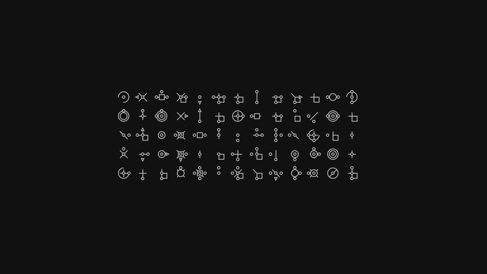
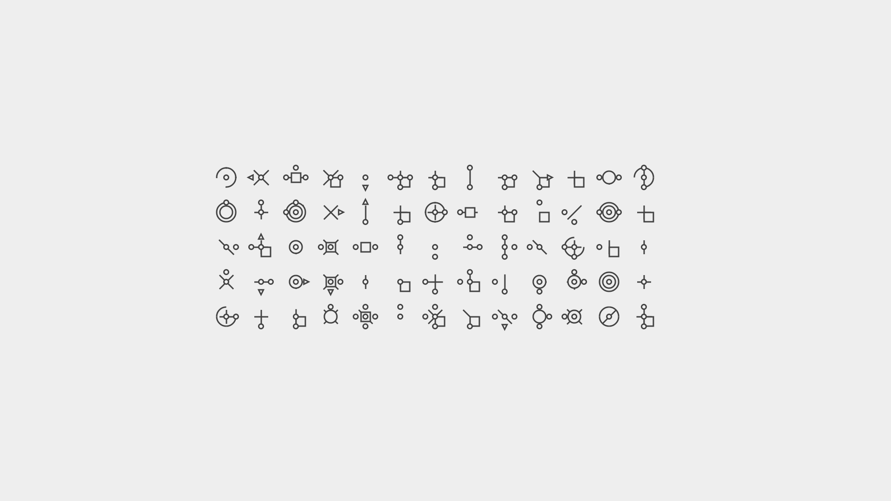
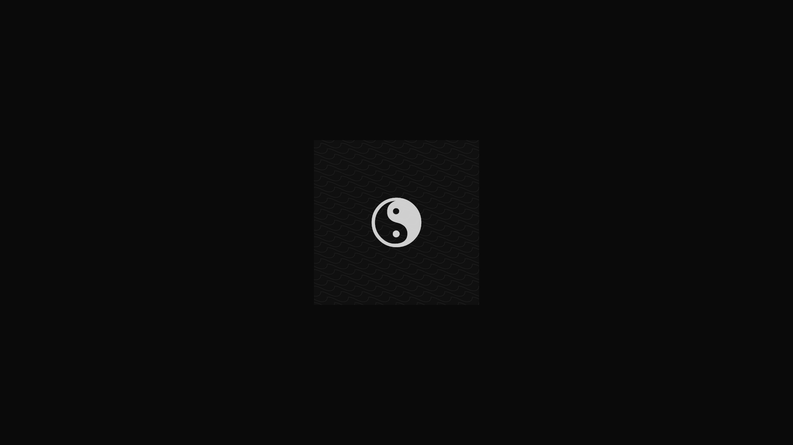
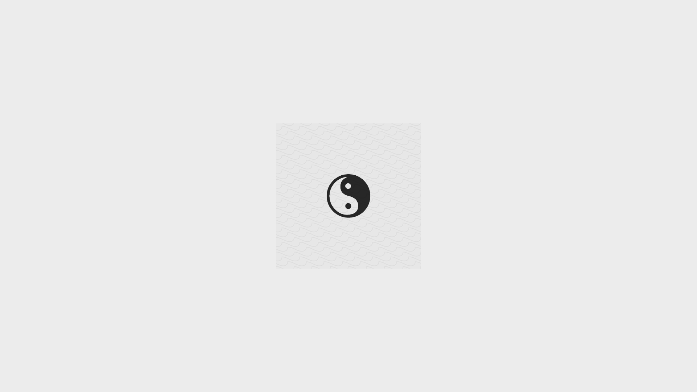

<h1 align="center"> Yin-Yang Wallpapers</h1>  

    Yin-Yang is Linux application that enables Auto Nightmode. This Repository hosts dark and light variant of each Wallpaper.

    
    
 

### Yin-Yang 

### Other Language

## Community Contributions

